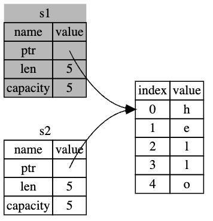

# Rust Manual

```
เริ่มแรกภาษาพัฒนาถูกพัฒนาโดย Graydon Hoare จาก Mozilla Research
พร้อมการสนับสนุนจาก Dave Herman, Brendan Eich และคนอื่น ๆ

ถูกออกแบบมาเพื่อประสิทธิภาพและความปลอดภัยของหน่วยความจำ
รับประกันความปลอดภัยของหน่วยความจำโดยใช้ borrow checker
โดยที่ไม่จำเป็นต้องใช้ Garbage collection
```

## Integer Types

```
Length Signed Unsigned
8-bit i8 u8
16-bit i16 u16
32-bit i32 u32
64-bit i64 u64
128-bit i128 u128
arch isize usize

Number literals Example
Decimal 98_222
Hex 0xff
Octal 0o77
Binary 0b1111_0000
Byte (u8 only) b'A'
```

## Floating-Point

```
single precision f32
double precision f64
```

## Operations

```
+ - * / %
```

## Boolean

```
true
false
```

## Borrowing String หรือ Slice String

```
&str
"Hello".to_string();

let s = String::from("hello world");
let hello = &s[0..5];
let world = &s[6..11];
```

## String

```rust
fn main() {
    let s1 = String::from("hello");
    let s2 = s1.clone();

    println!("s1 = {}, s2 = {}", s1, s2);
}
```



## Character

```
char
```

## Tuple

```rust
fn main() {
    let tup = (500, 6.4, 1);

    let (x, y, z) = tup;

    println!("The value of y is: {y}");
}
```

## Array

```rust
fn main() {
    let a = [1, 2, 3, 4, 5];
    let months = ["January", "February", "March", "April", "May", "June", "July",
              "August", "September", "October", "November", "December"];
    let a: [i32; 5] = [1, 2, 3, 4, 5];
    let a = [3; 5];
}
```

## Function

```rust
fn main() {
    let x = plus_one(5);

    println!("The value of x is: {x}");
}

fn plus_one(x: i32) -> i32 {
    x + 1 // tail expression
}
```

## Control Flow

```rust
fn main() {
    let number = 3;

    if number < 5 {
        println!("condition was true");
    } else {
        println!("condition was false");
    }
}
```

## Loop

```rust
fn main() {
    let mut count = 0;
    'counting_up: loop {
        println!("count = {count}");
        let mut remaining = 10;

        loop {
            println!("remaining = {remaining}");
            if remaining == 9 {
                break;
            }
            if count == 2 {
                break 'counting_up;
            }
            remaining -= 1;
        }

        count += 1;
    }
    println!("End count = {count}");
}

fn main() {
    let a = [10, 20, 30, 40, 50];
    let mut index = 0;

    while index < 5 {
        println!("the value is: {}", a[index]);

        index += 1;
    }
}

fn main() {
    let a = [10, 20, 30, 40, 50];

    for element in a {
        println!("the value is: {element}");
    }
}

fn main() {
    for number in (1..4).rev() {
        println!("{number}!");
    }
    println!("LIFTOFF!!!");
}

fn first_word(s: &String) -> usize {
    let bytes = s.as_bytes();

    for (i, &item) in bytes.iter().enumerate() {
        if item == b' ' {
            return i;
        }
    }

    s.len()
}
```

## Ownership Rules

```
- Each value in Rust has an owner.
- There can only be one owner at a time.
- When the owner goes out of scope, the value will be dropped.
```

## Borrowing

```
In languages with pointers, it’s easy to erroneously create a dangling pointer—a pointer that references a location in memory that may have been given to someone else—by freeing some memory while preserving a pointer to that memory. In Rust, by contrast, the compiler guarantees that references will never be dangling references: if you have a reference to some data, the compiler will ensure that the data will not go out of scope before the reference to the data does
```

```rust
fn main() {
    let reference_to_nothing = dangle();
}

fn dangle() -> &String {
    let s = String::from("hello");

    &s
}

fn no_dangle() -> String {
    let s = String::from("hello");

    s
}
```

## The Rules of References

```
- At any given time, you can have either one mutable reference or any number of immutable references.
- References must always be valid.
```

## Struct

```rust
struct User {
    active: bool,
    username: String,
    email: String,
    sign_in_count: u64,
}
```

## Method Syntax

```rust
#[derive(Debug)]
struct Rectangle {
    width: u32,
    height: u32,
}

impl Rectangle {
    fn area(&self) -> u32 {
        self.width * self.height
    }
}

fn main() {
    let rect1 = Rectangle {
        width: 30,
        height: 50,
    };

    println!(
        "The area of the rectangle is {} square pixels.",
        rect1.area()
    );
}
```

## Enum

```rust
enum IpAddrKind {
    V4,
    V6,
}

let four = IpAddrKind::V4;
let six = IpAddrKind::V6;

// -----------------------------------
enum IpAddr {
    V4(String),
    V6(String),
}

let home = IpAddr::V4(String::from("127.0.0.1"));
let loopback = IpAddr::V6(String::from("::1"));

```
